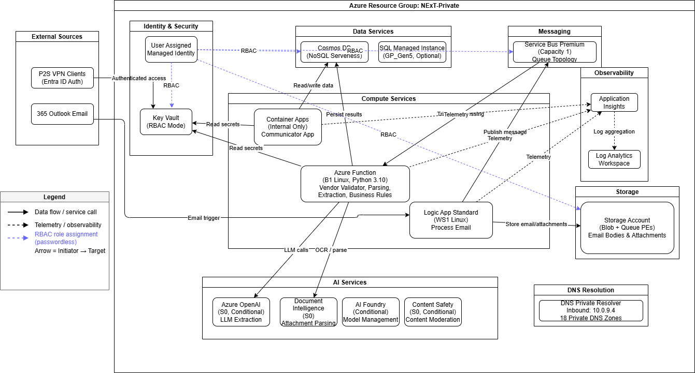
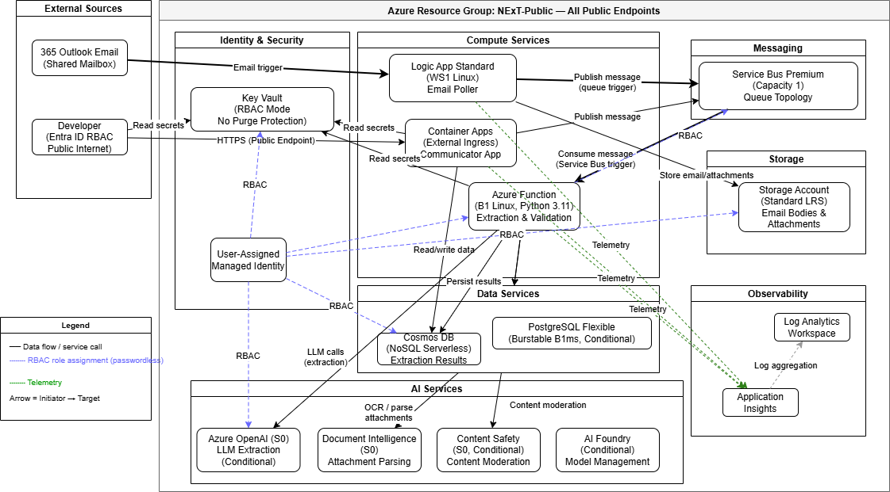
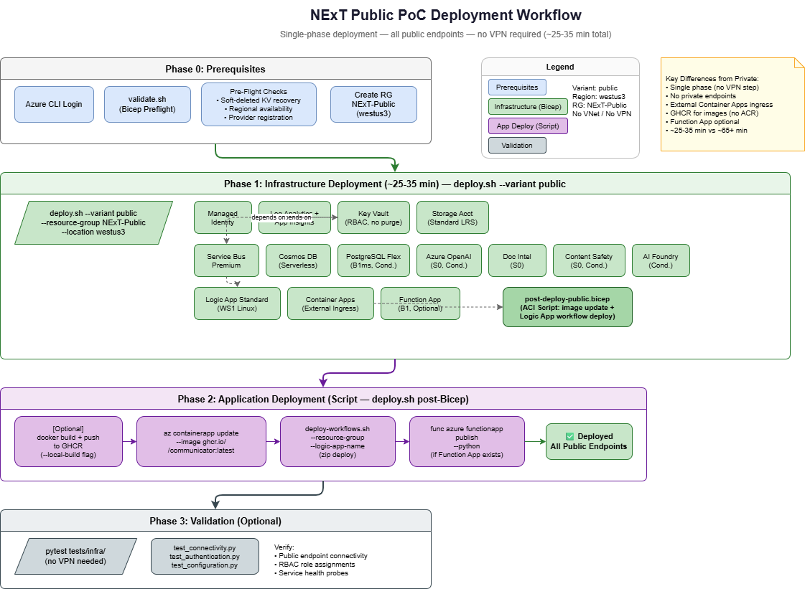
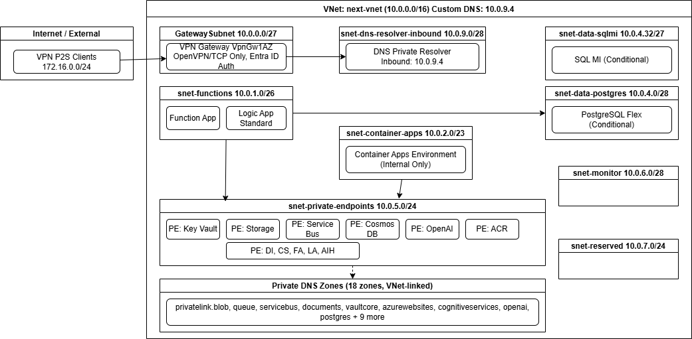
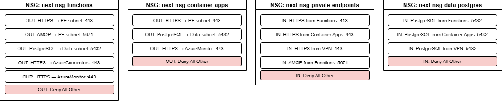
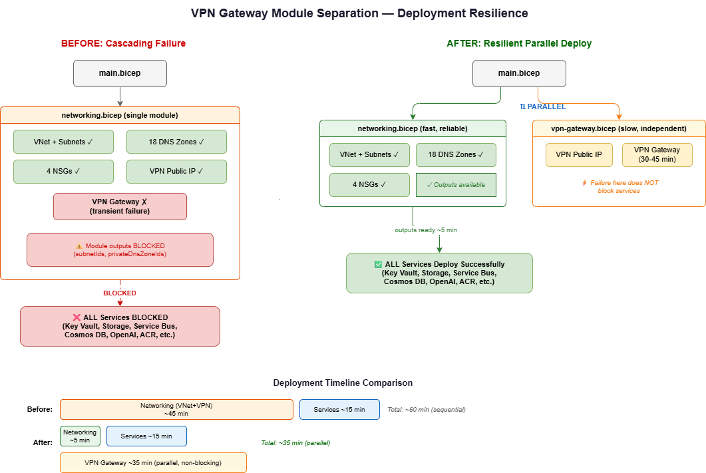

# NExT Infrastructure Architecture

**Deployment Tool**: Azure CLI + Bicep (Azure Verified Modules)
**Naming Convention**: `{baseName}{uniquePrefix}` (e.g., `next-kv`, `nextst`)

---
The NExT Accelerator is an Azure-hosted platform for automated vendor maintenance notification processing. It uses a Python-based agent workflow with Azure AI services (OpenAI, Document Intelligence, Content Safety) to extract, validate, and route structured data from unstructured email communications. The infrastructure supports two deployment variants: a fully private VNet-isolated deployment for production workloads and a public endpoint deployment for proof-of-concept and development scenarios.

---

## Deployment Variants

This infrastructure supports two deployment modes via separate orchestrator files: Public Variant and Private Variant

### IaC Private Deployment Overview
Full production-grade deployment with network isolation:
( Note: This can be modified if required )
- VNet (10.0.0.0/16) with 9 subnets and 4 NSGs
- Private endpoints for all PaaS services (~13 endpoints)
- 18 private DNS zones for endpoint resolution
- DNS Private Resolver (10.0.9.4) for VPN client DNS queries
- P2S VPN Gateway with OpenVPN/TCP and Entra ID authentication only



IaC Private Variant Deployment Code — `src/infra_deployment/private/main.bicep`


### IaC Public Deployment Overview

Simplified deployment without networking overhead:
- No VNet, private endpoints, or DNS zones
- No VPN Gateway or NSGs
- All services use public endpoints
- Faster deployment for development and experimentation


IaC Public Variant Deployment Code — `src/infra_deployment/public/main.bicep`

### Feature Comparison

| Capability | Private | Public |
|-----------|---------|--------|
| VNet Isolation | Yes | No |
| Private Endpoints | All services | None |
| VPN Gateway (P2S) | Yes (Entra ID auth) | No |
| DNS Zones | 18 private zones | Not applicable |
| NSG Enforcement | 4 NSGs, deny-all-other | Not applicable |
| Deployment Time | ~45-60 min | ~15-20 min |
| Cost (approximate) | Higher (VPN Gateway, PE charges) | Lower (no networking) |

### Phased Deployment (Private Mode)



The private deployment supports phased execution for the VPN chicken-and-egg problem: services require VPN connectivity for verification, but VPN requires network infrastructure first.


The `deploy.ps1` / `deploy.sh` scripts accept these parameters:

| Parameter | Values | Default | Purpose |
|-----------|--------|---------|---------|
| `-Phase` | `all`, `network`, `services` | `all` | Controls which modules deploy |
| `-Variant` | `public`, `private` | `private` | Selects orchestrator template |
| `-ResourceGroup` | string | from `.env` | Target resource group |
| `-Location` | string | `westus3` | Azure region |
| `-BaseName` | string | `next<random>` | Resource name prefix |
| `-WhatIf` | switch | off | Runs ARM what-if analysis only |

#### Phase 1: Network Foundation

```powershell
# Deploy network infrastructure (VNet, DNS, identity, observability) + VPN Gateway in parallel
pwsh -File src/infra_deployment/ps-scripts/deploy.ps1 -Phase network -Variant private -ResourceGroup NExT-Private -Location westus3 -BaseName next
```

```bash
# Bash equivalent
./src/infra_deployment/deploy.sh --phase network --variant private --resource-group NExT-Private --location westus3 --base-name next
```

Resources deployed:

- VNet (10.0.0.0/16) with 8 subnets and 4 NSGs
- 18 private DNS zones linked to VNet
- User-assigned managed identity
- Log Analytics workspace + Application Insights
- VPN Gateway (VpnGw1AZ) with OpenVPN/TCP and Entra ID-only P2S authentication (deploys in parallel via separate `vpn-gateway.bicep` module)
- Public IP (Standard, Static, Zone-redundant) for VPN Gateway

> **Note**: VPN Gateway deploys as a separate module in parallel with services. A VPN Gateway failure does NOT block service deployment. Services proceed as soon as the VNet and DNS zones are ready (~5 min). The deployment script automatically retries VPN Gateway on transient failure.

> **Note**: The DNS Private Resolver deploys automatically as part of `networking.bicep` with an inbound endpoint on subnet `snet-dns-resolver-inbound` (10.0.9.0/28). The VNet custom DNS is set to `10.0.9.4` for VPN clients to resolve private DNS zone records.

After Phase 1 completes (VNet and DNS ready in ~5 min; VPN Gateway continues provisioning in parallel for ~35 min):

1. VPN profile auto-downloads to `src/infra_deployment/private/vpn-client-profile/`
2. Import `AzureVPN/azurevpnconfig.xml` into Azure VPN Client
3. Connect to VPN and verify DNS resolution before proceeding


#### Phase 2: Service Deployment

```powershell
# Deploy all service modules (requires VPN for private endpoint verification)
pwsh -File src/infra_deployment/ps-scripts/deploy.ps1 -Phase services -Variant private -ResourceGroup NExT-Private -Location westus3 -BaseName next
```

```bash
./src/infra_deployment/deploy.sh --phase services --variant private --resource-group NExT-Private --location westus3 --base-name next
```

The script verifies VPN connectivity before proceeding — it resolves the ACR private endpoint and warns if a public IP is returned.

Resources deployed:

- Key Vault with private endpoint and RBAC mode
- Storage Account with blob and queue private endpoints
- Service Bus Premium with private endpoint
- Cosmos DB (NoSQL, Serverless) with private endpoint
- PostgreSQL Flexible Server (VNet-integrated, conditional)
- Azure OpenAI with private endpoint (conditional)
- Document Intelligence with private endpoint
- Content Safety with private endpoint (conditional)
- Container Registry with private endpoint
- Function App (VNet-integrated)
- Logic App Standard (VNet-integrated)
- Container Apps Environment (internal-only)

#### Full Deployment (Single Pass)

```powershell
# Deploy everything in one pass — network + services together (~45-60 min)
pwsh -File src/infra_deployment/ps-scripts/deploy.ps1 -Phase all -Variant private -ResourceGroup NExT-Private -Location westus3 -BaseName next
```

```bash
./src/infra_deployment/deploy.sh --phase all --variant private --resource-group NExT-Private --location westus3 --base-name next
```

Full deployment is suitable when VPN connectivity is not needed during deployment (verification happens post-deployment). The script reads `.env` for `postgreSQL_Password` and `AZURE_RESOURCE_GROUP` automatically.

#### Application Deployment (Post-Infrastructure)

After infrastructure is live (and VPN connected for private variant):

```bash
# Update Container App with GHCR image
az containerapp update --name next-ca --resource-group NExT-Private \
  --image ghcr.io/<owner>/communicator:latest

# Deploy Logic App workflows
bash src/logic_app/deploy-workflows.sh \
  --resource-group NExT-Private \
  --logic-app-name next-logic
```

```powershell
# PowerShell equivalent
az containerapp update --name next-ca --resource-group NExT-Private `
  --image ghcr.io/<owner>/communicator:latest

# Deploy Logic App workflows
pwsh -File src/logic_app/deploy-workflows.ps1 `
  -ResourceGroup NExT-Private `
  -LogicAppName next-logic
```

> **Note**: Container images are built and pushed to GHCR via GitHub Actions CI/CD. The deprecated `build-image.ps1` ACR Tasks workflow is no longer used. See [Private Deployment Guide](../../src/infra_deployment/private/README.md) or [Public Deployment Guide](../../src/infra_deployment/public/README.md) for details.

#### Logic App Workflow Deployment

Logic App workflows are deployed separately from infrastructure via zip deployment:

```bash
# Deploy all Logic App workflows (email-poller + hitl-approval)
bash src/logic_app/deploy-workflows.sh \
  --resource-group <RESOURCE_GROUP> \
  --logic-app-name <LOGIC_APP_NAME>
```

The script packages `email-poller/workflow.json` and `hitl-approval/workflow.json` with shared config files (`host.json`, `connections.json`, `parameters.json`) into a zip archive and deploys via `az logicapp deployment source config-zip`.

> **Note**: After initial deployment, Logic App API connections (Office 365, Outlook) require manual authorization in the Azure Portal.

#### What-If Analysis

```powershell
# Preview changes without deploying
pwsh -File src/infra_deployment/ps-scripts/deploy.ps1 -Phase all -Variant private -ResourceGroup NExT-Private -WhatIf
```

```bash
# Bash equivalent
./src/infra_deployment/deploy.sh --phase all --variant private --resource-group NExT-Private --what-if
```

---

## Private Variant Networking Diagram



---

## NSG Rules Summary



---

## Components

### Networking

| Resource | SKU/Config | Purpose |
|----------|-----------|---------|
| VNet (`next-vnet`) | 10.0.0.0/16, 9 subnets | Network isolation for all services |
| VPN Gateway (`next-vpn-gw`) | VpnGw1AZ, OpenVPN/TCP, Entra ID only | Developer access via P2S authentication |
| DNS Private Resolver (`next-dns-resolver`) | Inbound endpoint: 10.0.9.4 | DNS resolution for VPN clients to private DNS zones |
| Public IP (`next-vpn-pip`) | Standard, Static, Zone-redundant | VPN Gateway frontend |
| NSGs (4) | Per-subnet rules | Least-privilege network traffic control |
| Private DNS Zones (18) | VNet-linked | Private endpoint name resolution |

### Identity & Security

| Resource | SKU/Config | Purpose |
|----------|-----------|---------|
| Managed Identity (`next-identity`) | User Assigned | Passwordless RBAC access to all services |
| Key Vault (`next-kv`) | Standard, RBAC mode | Secrets management, private endpoint |

### Compute

| Resource | SKU/Config | Purpose |
|----------|-----------|---------|
| Function App (`next-func`) | B1, Linux, Python 3.11 | Vendor validation, parsing, field extraction, business rules |
| Logic App (`next-logic`) | WS1, Linux, Node.js | Email processing workflows, Service Bus integration |
| Container Apps (`next-ca-env`) | Internal-only environment | Communicator App, future microservices |

### Messaging

| Resource | SKU/Config | Purpose |
|----------|-----------|---------|
| Service Bus (`next-servicebus`) | Premium, Capacity 1 | Event-driven messaging between Logic App and Function App |

### Storage

| Resource | SKU/Config | Purpose |
|----------|-----------|---------|
| Storage Account (`nextst`) | Standard LRS, Blob + Queue PEs | Email bodies, attachments, function/workflow state |

### Data

| Resource | SKU/Config | Purpose |
|----------|-----------|---------|
| Cosmos DB (`next-cosmos`) | NoSQL, Serverless | Field definitions, agent configs, workflow states |
| PostgreSQL Flex | Burstable B1ms (conditional) | Relational data storage |

### AI Services

| Resource | SKU/Config | Region | Purpose |
|----------|-----------|--------|---------|
| Azure OpenAI (`next-oai`) | S0 (conditional) | westus3 | LLM-based field extraction |
| Document Intelligence (`next-di`) | S0 | westus3 | Attachment parsing (PDF, images) |
| AI Foundry | Hub + Project (conditional) | westus3 | Model management, experiments |
| Content Safety (`next-csafety`) | S0 (conditional) | westus3 | Content moderation for AI outputs |

### Observability

| Resource | SKU/Config | Purpose |
|----------|-----------|---------|
| Log Analytics Workspace (`next-law`) | PerGB2018 | Centralized log aggregation |
| Application Insights (`next-appinsights`) | Workspace-based | APM for Function App, Logic App, Container Apps |

### Container Registry

| Resource | SKU/Config | Purpose |
|----------|-----------|---------|
| Azure Container Registry (`nextacr`) | Basic | Container image hosting for Container Apps |

---

## Security Posture

| Control | Implementation |
|---------|---------------|
| **Network Isolation** | All services accessed via private endpoints only; no public endpoints |
| **Zero Trust Access** | VPN Gateway with OpenVPN/TCP and Entra ID-only P2S authentication |
| **Identity** | User Assigned Managed Identity with RBAC — no connection strings or keys |
| **NSG Enforcement** | Deny-all-other rules on all subnets; allow only required ports/protocols |
| **DNS Resolution** | DNS Private Resolver (10.0.9.4) enables VPN clients to resolve 18 private DNS zones |
| **Key Management** | Key Vault in RBAC mode — no access policies, role-based only |
| **TLS/Encryption** | FTPS disabled on all web apps; HTTPS enforced; storage encrypted at rest |
| **Subnet Delegation** | Functions, Container Apps, PostgreSQL, DNS Resolver each in delegated subnets |

---

## Deployment

### Prerequisites

- Azure CLI with Bicep extension
- Azure subscription with required resource providers registered
- Resource group (set `AZURE_RESOURCE_GROUP` in root `.env`)

### Deploy (Private — VNet Isolated)

```powershell
cd infra_deployment
az deployment group create `
  --resource-group NExT-Private `
  --template-file private/main.bicep `
  --parameters private/parameters.json
```

### Deploy (Public — PoC)

```powershell
cd infra_deployment
az deployment group create `
  --resource-group NExT-Public `
  --template-file public/main.bicep `
  --parameters public/parameters.json
```

### Conditional Flags

| Parameter | Default | Notes |
|-----------|---------|-------|
| `deployOpenAi` | `false` | Requires subscription quota approval at https://aka.ms/oai/access |
| `deployPostgres` | `false` | Restricted in some regions; check regional availability |

---

## Data Flow

1. **Ingest**: 365 Outlook email arrives → Logic App triggers
2. **Store**: Logic App saves email body + attachments to Storage Account (Blob)
3. **Queue**: Logic App publishes Service Bus message with metadata
4. **Process**: Function App triggers on Service Bus message
5. **Parse**: Function App calls Document Intelligence for attachment OCR
6. **Extract**: Function App calls Azure OpenAI for field extraction via LLM
7. **Validate**: Function App applies business rules, mappings, normalizations
8. **Persist**: Function App writes results to Cosmos DB
9. **Observe**: All telemetry flows to Application Insights → Log Analytics

---

## Module Reference

| Module File | AVM Registry | Version |
|-------------|-------------|---------|
| `networking.bicep` | `avm/res/network/virtual-network` | 0.9.0 |
| | `avm/res/network/network-security-group` | 0.5.1 |
| | `avm/res/network/private-dns-zone` | 0.7.1 |
| `identity.bicep` | `avm/res/managed-identity/user-assigned-identity` | 0.4.1 |
| `observability.bicep` | `avm/res/operational-insights/workspace` | 0.9.1 |
| | `avm/res/insights/component` | 0.4.2 |
| `keyvault.bicep` | `avm/res/key-vault/vault` | 0.11.1 |
| `storage.bicep` | `avm/res/storage/storage-account` | 0.18.0 |
| `servicebus.bicep` | `avm/res/service-bus/namespace` | 0.12.0 |
| `cosmosdb.bicep` | `avm/res/document-db/database-account` | 0.11.1 |
| `function-app.bicep` | `avm/res/web/site` | 0.15.1 |
| `logic-app.bicep` | `avm/res/web/serverfarm` | 0.4.1 |
| | `avm/res/web/site` | 0.15.1 |
| `container-apps.bicep` | `avm/res/app/managed-environment` | 0.10.1 |
| `document-intelligence.bicep` | `avm/res/cognitive-services/account` | 0.10.1 |
| `openai.bicep` | `avm/res/cognitive-services/account` | 0.10.1 |
| `ai-foundry.bicep` | `avm/res/machine-learning-services/workspace` | 0.10.1 |
| `acr.bicep` | `avm/res/container-registry/registry` | 0.6.0 |
| `content-safety.bicep` | `avm/res/cognitive-services/account` | 0.10.1 |
| `vpn-gateway.bicep` | `avm/res/network/virtual-network-gateway` | 0.11.0 |
| | `avm/res/network/public-ip-address` | 0.8.0 |

---

## Deployment Resilience

The VPN Gateway module deploys separately from network and service modules to prevent cascading failures. Separating VPN Gateway into its own module (`vpn-gateway.bicep`) that deploys in parallel, enables 

- Services begin deploying as soon as VNet and DNS zones are ready (~5 min)
- VPN Gateway provisions independently without blocking service availability
- If VPN Gateway fails, all services remain deployed and functional (private endpoints work without VPN)
- The deployment script (`deploy.sh` / `deploy.ps1`) detects VPN-only failures and retries automatically

This means a VPN Gateway timeout or Azure capacity constraint does not require redeploying the entire infrastructure.
 
---

## Developer Setup

### Dev Container (Recommended)

The `.devcontainer/` configuration provides a pre-configured development environment with all required tools.

**Prerequisites**: Docker Desktop, VS Code with Dev Containers extension, Azure VPN Client

1. Open workspace in VS Code
2. Select "Reopen in Container" when prompted
3. Connect to Azure VPN on the host machine (container uses host DNS relay)
4. Run `az login` inside container

**Tools included**: Python 3.10, Azure CLI, Bicep, Azure Functions Core Tools v4, go-task, Node.js 20

### Offline Development (Azurite)

For inner-loop development without VPN connectivity:

1. Start Azurite: `bash .devcontainer/start-azurite.sh`
2. Use Azurite connection string in local.settings.json or environment variables
3. Storage Blob, Queue, and Table endpoints available at localhost

### GitHub Codespaces

For cloud-based development with private network access:

1. Set `TAILSCALE_AUTHKEY` secret in repository Codespaces settings
2. Create Codespace — Tailscale auto-connects for private endpoint routing
3. Alternative: configure Azure Relay Hybrid Connection
