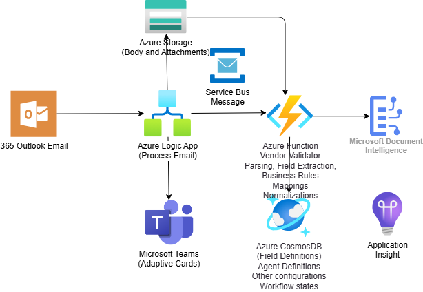
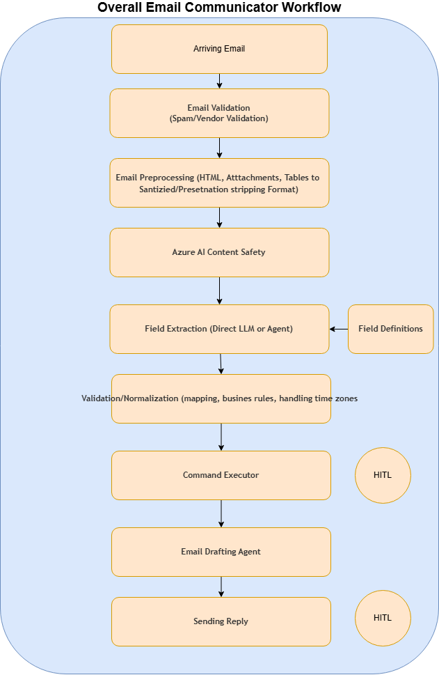
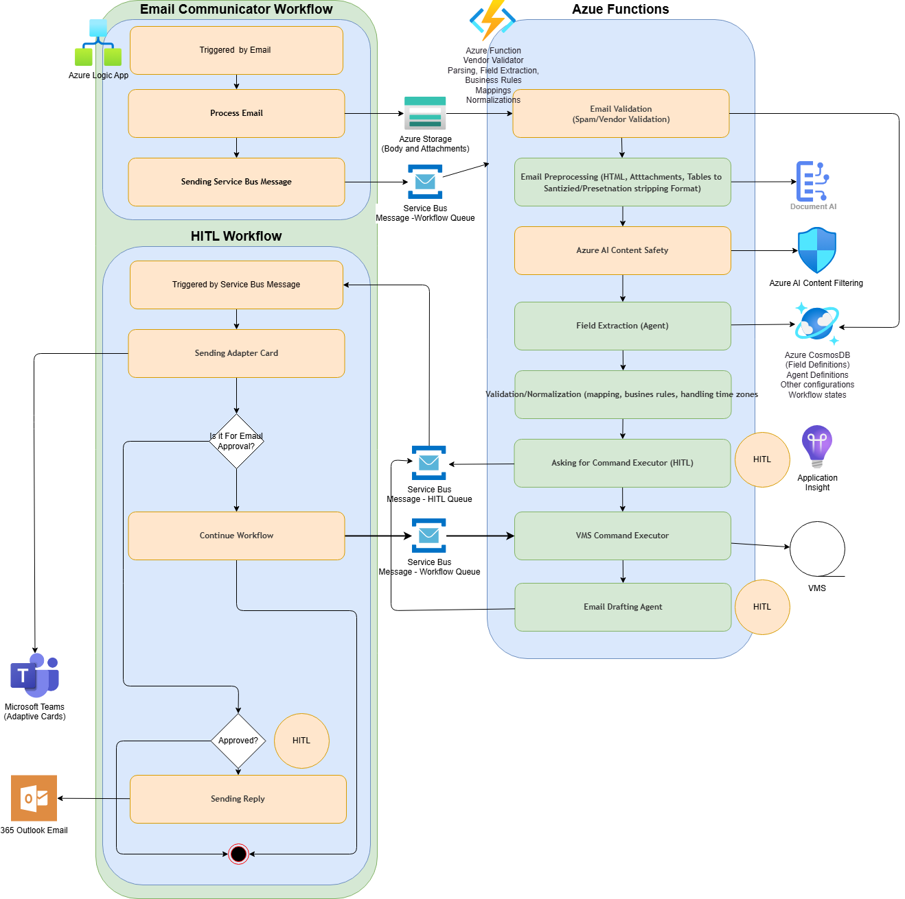

This file intentionally uses only the architecture diagram to convey the system design; supplementary prose is minimized per request. For deeper narrative see ADRs or previous revisions in version control.

## Diagram



## 1. High-Level Overview

NExT (Notification Extraction Tool) is an email-driven communication system for processing vendor maintenance
notifications and coordinating the resulting actions with human approval where
needed. The architecture separates ingress and orchestration concerns from
AI-assisted interpretation and command generation.

At a high level, the system consists of these major pieces:

- Outlook as the source of inbound vendor email and the final outbound reply
  channel.
- Azure Logic App as two coordinated workflows: an email communicator flow for
   mailbox-triggered ingestion and a HITL flow for approvals and final reply
   handling.
- Azure Service Bus as the decoupling layer that carries workflow messages
   between Logic App and the Azure Function runtime using `workflow-queue` for
   messages into the agent workflow and `hitl-queue` for approval requests
   into the HITL workflow.
- Azure Storage Account as the transient content store that holds normalized
  email payloads between Logic App ingestion and Azure Function processing.
- Azure Function as the core agent runtime responsible for validation,
  preprocessing, extraction, normalization, command generation, and draft
  response generation.
- Azure Cosmos DB as the system knowledge and state store for field
  definitions, agent definitions, workflow state, and other runtime
  configuration.
- Microsoft Teams adaptive cards as the human-in-the-loop approval surface.
- Azure Application Insights for telemetry and operational observability.
- Azure AI services, including content safety and Microsoft Document
  Intelligence for document extraction, supporting the email-processing path.

The overall design is intentionally staged. Incoming email is first converted
into a normalized, machine-processable representation. The Azure Function then
applies validation, extraction, business rules, and mapping logic before the
system either asks a human to approve an action or proceeds with downstream
execution. Reply generation is also gated through a human approval checkpoint
before the final email is sent.

The orchestration model also shows that Logic App is split into an
email communicator workflow and a separate HITL workflow. The communicator
workflow handles mailbox-triggered ingestion and the first Service Bus handoff.
The HITL workflow handles approval requests, adaptive cards, and the final
outbound reply path.

The diagrams also indicate that email content is not passed directly from
Logic App into the Azure Function as an in-memory payload alone. Instead, the
Logic App persists the prepared email content into Azure Storage Account, and
the Azure Function reads that staged content as part of the downstream
processing workflow. This gives the system a durable handoff point between the
workflow engine and the agent runtime.

## 2. Generic Workflow



The generic workflow shown in the diagrams is a staged transformation from raw
email into an approved operational response.

1. **Arriving Email**
   The workflow begins when an inbound message enters the system. This is the
   raw starting point for all later interpretation and action.
1. **Email Validation (Spam/Vendor Validation)**
   The message is checked to confirm it is a valid vendor communication and not
   spam or an irrelevant message. Only validated emails continue through the
   automated flow.
1. **Email Preprocessing (HTML, Attachments, Tables to Sanitized/Presentation Stripping Format)**
   The email content is transformed into a cleaner, more structured form.
   Presentation-heavy HTML is simplified, attachment content is surfaced, and
   table-heavy content is converted into a format that is easier to interpret.
1. **AI Content Safety**
   The preprocessed content is checked against safety controls before the
   workflow uses it for deeper extraction and decision-making.
1. **Field Extraction (Direct LLM or Agent)**
   The system extracts structured business data from the message. This is where
   unstructured communication becomes usable fields such as intent, ticket
  references, dates, and other actionable details. The diagram also shows
  field definitions as an input to this step, meaning extraction is guided by
  predefined definitions of what should be captured and how the data should be
  interpreted.
1. **Validation/Normalization (mapping, business rules, handling time zones)**
   The extracted values are validated and normalized so they can be used
   consistently. This includes mapping values into canonical forms, applying
   business rules, and resolving time-related details such as time zones.
1. **Command Executor**
   If the interpreted message requires a concrete system action, that action is
   performed here, but only after the command approval checkpoint returns an
   approved response.
1. **Email Drafting Agent**
   After interpretation and any approved action, the system prepares the
   outbound email response.
1. **Sending Reply**
   The drafted response is sent back out as the final step in the workflow,
   but only after the email approval checkpoint returns an approved response.

The diagrams also show two explicit human-in-the-loop checkpoints:

- At the command execution stage.
- At the reply-sending stage.

This makes the system operationally useful without requiring the PoC to be
fully autonomous.

Both checkpoints now share the same routing rules inside the Azure Function
workflow:

- Approved responses continue on the main path.
- Valid business rejections terminate through one shared
   `terminate_rejected` executor.
- Invalid approval input is treated as an error path rather than a business
   terminal branch.

## 3. Workflow Orchestration using Logic App and Microsoft Agent Framework



This section explains how the workflow is orchestrated across Logic App, the
agent runtime, and the supporting platform services.

### 3.1 Step-by-Step Service Mapping

1. **Email arrival**
   After an email is received, the email communicator Logic App workflow is
   triggered from Outlook.
1. **Process email and stage content**
   The communicator workflow processes the inbound message body and
   attachments, normalizes the payload shape, and stores the staged content in
   Azure Storage Account.
1. **Initial Service Bus handoff**
   The communicator workflow sends the first Service Bus message on
   `workflow-queue` so the Azure Function runtime can begin downstream
   processing without remaining coupled to the mailbox trigger.
1. **Email validation**
   The Azure Function performs spam and vendor validation and determines
   whether the message should continue through the automation path.
1. **Email preprocessing**
   The Azure Function converts HTML, attachments, and tables into a sanitized,
   presentation-stripped format that is easier for the agent to interpret.
1. **Supporting AI services**
   During preprocessing and analysis, the Azure Function calls Microsoft
   Document Intelligence for document extraction and Azure AI Content Safety
   for content filtering.
1. **Field extraction**
   The Azure Function performs field extraction through the Microsoft Agent
   Framework-based agent path, using field definitions, agent definitions, and
   runtime configuration stored in Cosmos DB.
1. **Validation and normalization**
   The Azure Function applies mappings, business rules, and time-zone-aware
   normalization before deciding what operational step comes next.
1. **Command approval request**
   When an operational command requires human approval, the Azure Function
   emits a Service Bus message on `hitl-queue` that activates the HITL Logic
   App workflow. The `checkpointId` is carried in the message payload and is
   consumed later by Azure Function through Microsoft Agent Framework to
   resume the workflow.
1. **HITL workflow activation**
   The HITL Logic App workflow is triggered by Service Bus, sends an adaptive
   card to Microsoft Teams, and waits for the human decision.
1. **Resume after command approval response**
   The HITL workflow always sends the same `approval.responded` envelope back
   to `workflow-queue`, with `approvalType: command` and an
   `approvalStatus` of `approved` or `rejected`. Azure Function restores the
   checkpoint and resumes the workflow from that state.
1. **Command branch handling**
   The Azure Function owns the business branch decision after resume. If the
   command response is approved, the workflow executes the command, updates
   workflow state in Cosmos DB, and records telemetry in Application
   Insights. If the command response is rejected, the workflow routes to the
   shared `terminate_rejected` terminal and stops without executing the VMS
   action or requesting email review.
1. **Email drafting**
   Only the approved command path continues to draft the outbound email.
1. **Email approval path**
   The drafted email is sent into the HITL workflow, which uses the adaptive
   card path again. The HITL Logic App still returns the same
   `approval.responded` envelope shape, this time with
   `approvalType: email`.
1. **Reply dispatch or terminal rejection**
   The Azure Function resumes from the email checkpoint and again owns the
   branch. Approved email review reaches the final send path. Rejected email
   review routes to the same shared `terminate_rejected` terminal. Invalid
   approval input fails as an error and is not treated as a valid business
   outcome.

### 3.2 Logic App

The architecture uses two distinct Logic App workflows rather than one
single orchestration flow:

- The **email communicator workflow** is triggered by inbound email, processes
   the message, stages the content, and emits the initial `workflow-queue`
   message.
- The **HITL workflow** is triggered by Service Bus, sends the adaptive card,
   returns `approval.responded` for both command and email review, and does not
   perform rejection-specific routing on behalf of the Azure Function.

In practice, this means Logic App owns mailbox integration, approval routing,
and the orchestration checkpoints around the agent runtime, while Service Bus
is used to move work between the communicator path, the HITL path, and the
Azure Function. `workflow-queue` is the inbound queue for the Microsoft Agent
Framework-based workflow hosted in Azure Function. `hitl-queue` is the
outbound approval queue used when the workflow pauses for HITL.

The ownership boundary is explicit:

- Logic App prompts for the human decision and returns the stable
   `approval.responded` contract.
- Azure Function decides whether the workflow continues or terminates.
- Logic App does not create a separate rejection event type or extra queue hop
   for binary reject handling.

### 3.3 AI Agent Hosted in Azure Function

The Azure Function is the interpretation and decisioning layer. It is where the
workflow turns staged email content into structured meaning and operational
outcomes.

Its internal path is explicit: email validation,
preprocessing, content safety, field extraction, validation and normalization,
asking for command executor approval, branching on the approval result,
command execution on approved paths, email drafting, and a second branch on
email approval.

Its role is therefore to validate and preprocess content, invoke supporting AI
services, extract fields, normalize values, raise approval requests when
needed, execute approved commands, and draft the outbound response.

When the response is a valid rejection, the Function workflow terminates
through one shared terminal executor. When the response payload is invalid,
the Function treats that as an execution error rather than a business outcome.

Conceptually, Logic App owns workflow movement and approvals, while the Azure
Function owns interpretation, normalization, decisioning, and operational
execution.

### 3.4 Example Storage Layout and Message Payloads

The diagrams do not define a concrete storage or message contract, so the
examples below are illustrative. They show one practical way to organize the
staged email content in Storage Account and the messages sent between Logic
App, the HITL workflow, and the agent app.

The storage container name is configuration rather than message payload. In
the current contract, the container is `email-staging`. The `storagePrefix`
field on the inbound Logic App message is the source of truth for the path
inside that container. Today `storagePrefix` is just the `workflowInstanceId`,
but downstream systems should treat it as opaque so future path changes do not
require code changes.

### 3.5 PoC Scope Exclusions

The current proof of concept intentionally excludes several operational and
mailbox-management concerns so the implementation can stay focused on the core
agent workflow and HITL path.

- Service Bus dead-letter handling is outside PoC scope.
- Service Bus retry-policy design and tuning are outside PoC scope.
- Outlook email routing, flagging, and moving messages between folders are
   outside PoC scope.

Queue usage in these examples is intentionally simple:

- `workflow-queue` sends messages into the Azure Function workflow. This
   includes the initial start message from the communicator workflow and the
   resume message from the HITL workflow after approval.
- `hitl-queue` sends approval-request messages from the Azure Function
   workflow to the HITL Logic App workflow.

#### Example Storage Account Layout

```text
email-staging/
   <storagePrefix>/
        email.json
        attachments/
            001-original.pdf
            002-circuit-list.xlsx
         extraction-result.json
         normalized-result.json
         command-request.json
         draft-reply.json
```

#### Example Meaning of the Folders

- `<storagePrefix>/` stores the raw staged email content created by Logic App
  when the email first arrives. In the current contract, `storagePrefix`
  equals `workflowInstanceId`.
- `email.json` stores the sender email, subject, body, and the list of
   attachment file names for the message.
- `attachments/` stores the original attachment files exactly as received.

#### Example Email File

```json
{
   "internetMessageId": "DM6PR12MB1234ABCDEF1234567890@example.com",
   "workflowInstanceId": "next-communicator-08dd4a3e-5b07-4e1a-9b3f-1c6d2e8f9a01",
   "receivedAt": "2026-05-01T08:15:12Z",
   "senderEmail": "vendor@example.com",
   "subject": "Maintenance Notification for NCC-24173",
   "body": "Planned maintenance will begin on 2026-05-01 at 10:00 UTC. Please review the attached circuit list and confirm approval.",
   "attachments": [
      "001-original.pdf",
      "002-circuit-list.xlsx"
   ]
}
```

#### Example workflow-queue Message from Logic App to the Agent Workflow

```json
{
   "queueName": "workflow-queue",
   "eventType": "email.received",
   "internetMessageId": "DM6PR12MB1234ABCDEF1234567890@example.com",
   "workflowInstanceId": "next-communicator-08dd4a3e-5b07-4e1a-9b3f-1c6d2e8f9a01",
   "storagePrefix": "next-communicator-08dd4a3e-5b07-4e1a-9b3f-1c6d2e8f9a01",
   "checkpointId": null,
   "receivedAt": "2026-05-01T08:15:12Z"
}
```

This message is intentionally small. The Service Bus payload should carry
references and routing information while the larger
email content remains in Storage Account.

#### Example hitl-queue Message from the Agent Workflow to the HITL Workflow

```json
{
   "queueName": "hitl-queue",
   "eventType": "command-approval.requested",
   "internetMessageId": "DM6PR12MB1234ABCDEF1234567890@example.com",
   "workflowInstanceId": "next-communicator-08dd4a3e-5b07-4e1a-9b3f-1c6d2e8f9a01",
   "workflowPrefix": "next-communicator-08dd4a3e-5b07-4e1a-9b3f-1c6d2e8f9a01",
   "checkpointId": "<populated_by_agent_workflow_at_command_approval_point>",
   "approvalType": "command",
   "adaptiveCardMessage": "the following command is going to be executed"
}
```

#### Example workflow-queue Resume Message from the HITL Workflow Back to the Agent Workflow

```json
{
   "queueName": "workflow-queue",
   "eventType": "approval.responded",
   "workflowInstanceId": "next-communicator-08dd4a3e-5b07-4e1a-9b3f-1c6d2e8f9a01",
   "workflowPrefix": "next-communicator-08dd4a3e-5b07-4e1a-9b3f-1c6d2e8f9a01",
   "checkpointId": "REPLACE_WITH_COMMAND_CHECKPOINT_ID_FROM_HITL_OUTPUT",
   "approvalType": "command",
   "approvalStatus": "approved"
}
```

The same resume envelope is also used for command rejection. The only change is
`approvalStatus: "rejected"`. No additional event type or queue is required.
When that rejected message is replayed, the Azure Function workflow terminates
through `terminate_rejected` and does not emit an email approval request.

#### Example hitl-queue Message Used for Email Approval

```json
{
   "queueName": "hitl-queue",
   "eventType": "email-approval.requested",
   "internetMessageId": "DM6PR12MB1234ABCDEF1234567890@example.com",
   "workflowInstanceId": "next-communicator-08dd4a3e-5b07-4e1a-9b3f-1c6d2e8f9a01",
   "workflowPrefix": "next-communicator-08dd4a3e-5b07-4e1a-9b3f-1c6d2e8f9a01",
   "checkpointId": "<populated_by_agent_workflow_at_email_approval_point>",
   "approvalType": "email",
   "adaptiveCardMessage": "We are going to send a message to next@next.com to reply to their messages"
}
```

#### Example workflow-queue Approval or Rejection of Email Send to MAF Workflow

```json
{
   "queueName": "workflow-queue",
   "eventType": "approval.responded",
   "workflowInstanceId": "next-communicator-08dd4a3e-5b07-4e1a-9b3f-1c6d2e8f9a01",
   "workflowPrefix": "next-communicator-08dd4a3e-5b07-4e1a-9b3f-1c6d2e8f9a01",
   "checkpointId": "REPLACE_WITH_EMAIL_CHECKPOINT_ID_FROM_HITL_OUTPUT",
   "approvalType": "email",
   "approvalStatus": "approved"
}
```

The email rejection path uses the same envelope shape with
`approvalStatus: "rejected"`. Azure Function terminates the workflow after the
resume and does not send the outbound reply. Invalid approval payloads remain
error cases rather than business-terminal branches.

## 4. Component Boundaries

The diagrams imply the following boundary model:

- Logic App owns triggers, asynchronous workflow progression, approval
   prompting, and final reply dispatch for approved drafts.
- Azure Storage Account owns the transient persisted email payload exchanged
  between orchestration and AI processing.
- Azure Function owns interpretation, enrichment, business logic, command
   preparation, branch decisions after resume, and workflow termination on
   valid rejection.
- Cosmos DB owns persistent definitions and workflow state.
- Teams owns the operator approval experience.
- Outlook remains both the ingress and egress communication surface.

This separation is useful because it allows the AI-heavy part of the system to
evolve independently from the workflow plumbing and external messaging
integrations.
